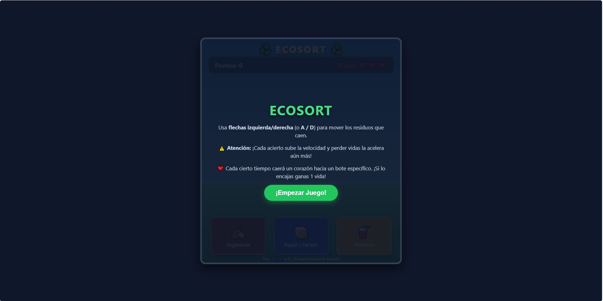
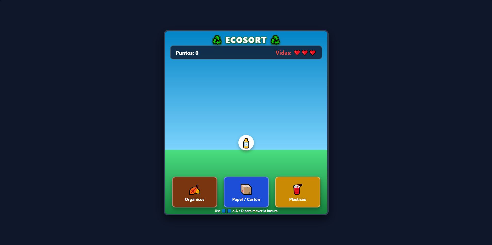
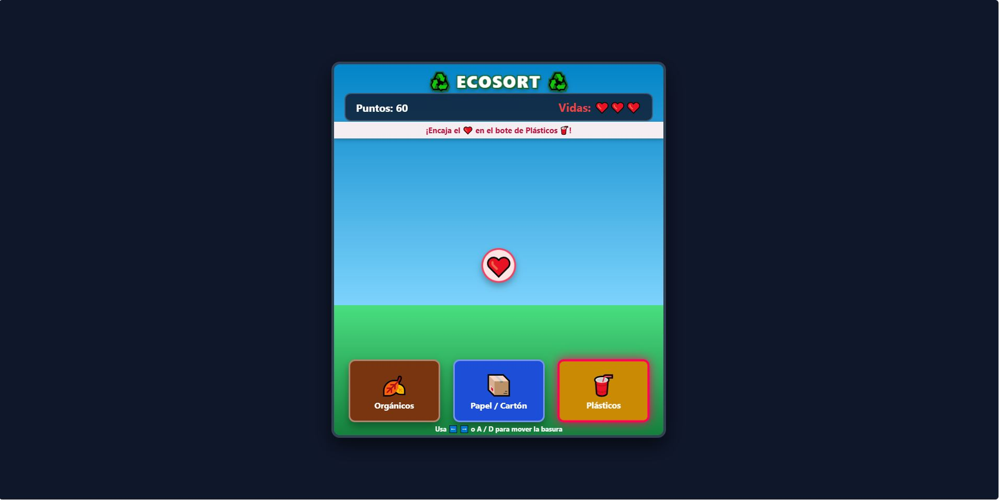
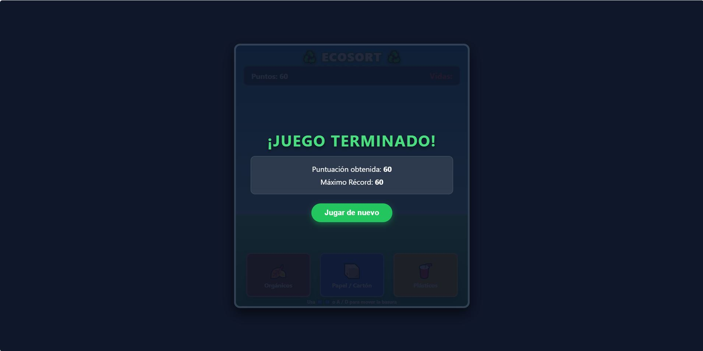

# EcoSort: Desafío de Reciclaje

[Haga clic aquí para jugar en línea](https://ArielAcarapi.github.io/game-development-portfolio/02-ecosort/)

---

## Descripción del Juego

EcoSort: Desafío de Reciclaje es un videojuego web educativo diseñado como solución al problema planteado por la organización ambiental EcoAcción. La propuesta aborda la falta de conocimiento sobre la separación correcta de residuos en la comunidad, especialmente en jóvenes y niños, mediante una experiencia dinámica e interactiva.

El jugador controla la posición horizontal de diferentes tipos de residuos que caen desde la parte superior de la pantalla. Su misión es guiarlos hacia el contenedor correspondiente antes de que toquen la base.

### Objetivo del Jugador
Clasificar la mayor cantidad posible de residuos orgánicos, papel/cartón y plásticos en sus respectivos contenedores para acumular puntos, conservar las vidas disponibles y establecer la puntuación máxima.

### Mecánica Principal
* Desplazamiento horizontal: Control de movimiento a la izquierda y derecha mediante teclado para dirigir el residuo activo mientras cae de forma continua.
* Clasificación por contenedores: Tres contenedores fijos en la base (Orgánicos, Papel/Cartón y Plásticos) con detección de colisión en tiempo real.
* Eventos especiales de salud: Aparición periódica de elementos de recuperación (corazones) que requieren ser dirigidos a un contenedor objetivo específico para restaurar una vida.
* Dificultad dinámica: Incremento progresivo de la velocidad de caída con cada acierto y penalización por errores.

---

## Ficha Técnica

| Parámetro | Detalle |
| :--- | :--- |
| Nombre Definitivo | EcoSort: Desafío de Reciclaje |
| Desarrollador | Ariel Vidal Acarapi Limachi |
| Género | Arcade / Educativo / Habilidad |
| Público Objetivo | Jóvenes y estudiantes de nivel secundario (11 a 16 años) |
| Plataforma | Web (Ejecución directa en navegador) |
| Lenguajes y Herramientas | HTML5, CSS3, JavaScript Vanilla, LocalStorage API |
| Estilo Visual | Interfaz adaptativa con degradados, animaciones CSS y elementos dinámicos |

---

## Controles e Instrucciones

### Controles de Teclado
* Flecha Izquierda / Tecla A: Mover el residuo hacia la izquierda.
* Flecha Derecha / Tecla D: Mover el residuo hacia la derecha.
* Botón de Inicio / Reinicio: Clic con el ratón o toque táctil para iniciar o reiniciar la partida.

### Reglas del Juego
1. Vidas Iniciales: La partida inicia con 3 vidas (con un límite máximo acumulable de 5).
2. Clasificación de Residuos:
   * Orgánicos: Residuos biodegradables como hojas, cáscaras o restos de comida.
   * Papel y Cartón: Hojas de papel, periódicos y cajas de cartón.
   * Plásticos: Botellas, envases y bolsas plásticas.
3. Puntuación y Dificultad:
   * Cada acierto otorga +10 puntos e incrementa ligeramente la velocidad de caída.
   * Los errores restan 1 vida e incrementan la velocidad como penalización adicional.
4. Evento de Corazón:
   * Cada 7 elementos aparece un corazón que indica un contenedor destino específico. Si se logra encajar correctamente, se restaura 1 vida y se otorgan +15 puntos.
5. Condición de Derrota: Perder todas las vidas disponibles. El juego almacena la puntuación máxima obtenida mediante la API de LocalStorage.

---

## Capturas de Pantalla

| Pantalla Principal | Pantalla de Juego |
| :---: | :---: |
|  |  |

| Evento Especial | Pantalla de Game Over |
| :---: | :---: |
|  |  |

---

## Proceso de Desarrollo y Uso de Inteligencia Artificial

El desarrollo de EcoSort siguió las cuatro fases del proceso formal de desarrollo de videojuegos: pre-producción, producción, testeo y lanzamiento.

### Tabla de Pre-producción

| Aspecto | Descripción |
| :--- | :--- |
| Nombre del juego | EcoSort: Desafío de Reciclaje |
| Género | Arcade / Educativo / Habilidad |
| Objetivo del jugador | Clasificar residuos que caen para acumular la máxima puntuación y evitar perder vidas. |
| Mecánica principal | Controlar el desplazamiento horizontal de los residuos que caen para alinearlos con su contenedor. |
| Reglas del juego | Teclas A/D o Flechas para mover. Aciertos suman puntos y aumentan velocidad; errores restan vidas. |
| Condición de victoria | Superar la puntuación récord personal acumulando aciertos continuos. |
| Condición de derrota | Agotar las vidas disponibles al clasificar incorrectamente los residuos o perderlos. |
| Enseñanza sobre reciclaje | Identificación clara de las tres categorías principales de residuos (Orgánicos, Papel/Cartón y Plásticos). |
| Jugador objetivo | Jóvenes y estudiantes de nivel secundario (11-16 años). |

### Registro de Iteraciones de Producción

| Versión | Problema Detectado | Acción Realizada | Resultado |
| :---: | :--- | :--- | :--- |
| V1 | La velocidad inicial era constante y el juego se volvía monótono rápidamente. | Se implementó un sistema de aceleración progresiva por aciertos y penalizaciones por error. | Curva de dificultad dinámica que mantiene la atención del jugador. |
| V2 | El jugador no tenía oportunidades de recuperarse tras cometer errores consecutivos. | Se diseñó la mecánica de bonus de corazón con contenedor objetivo aleatorio cada 7 ítems. | Mayor profundidad táctica y oportunidad de recuperación. |
| V3 | La puntuación se perdía al recargar la página. | Se integró el almacenamiento local (LocalStorage API) para conservar el récord máximo. | Motivación de rejugabilidad para superar el récord guardado. |

---

## Tabla de Validación (Peer Review)

Resultados de la validación técnica basada en la guía de práctica:

| Criterio de Validación | Cumple (Sí/No) | Observaciones / Resultado |
| :--- | :---: | :--- |
| El juego funciona sin errores técnicos | Sí | Carga correcta del ciclo de juego (game loop) a 60 FPS sin interrupciones. |
| La mecánica principal es clara para el jugador | Sí | Las instrucciones iniciales y los controles por teclado son de fácil comprensión. |
| Se puede llegar a la condición de victoria | Sí | Se permite acumular puntos indefinidamente y guardar el récord máximo. |
| Se puede llegar a la condición de derrota | Sí | Al perder las 3 vidas se despliega la pantalla de Game Over de forma correcta. |
| El juego enseña correctamente a reciclar | Sí | Refuerza la asociación entre el tipo de residuo y su contenedor adecuado. |
| El juego es entendible para el público objetivo definido | Sí | Interfaz limpia, tipografía legible y controles intuitivos. |

---

## Aprendizajes y Mejoras Futuras

### Aprendizajes Clave
* Implementación de ciclos de juego en HTML5 DOM utilizando `requestAnimationFrame`.
* Manejo de eventos de teclado asíncronos y detección de colisiones por coordenadas horizontales.
* Persistencia de datos en el cliente mediante la API de LocalStorage.

### Mejoras Futuras
* Incorporación de efectos de sonido sintéticos para aciertos, errores y eventos especiales mediante Web Audio API.
* Adición de nuevas categorías de reciclaje como vidrios, metales y residuos peligrosos.
* Inclusión de modos de juego por tiempo o niveles de dificultad seleccionables al inicio.
