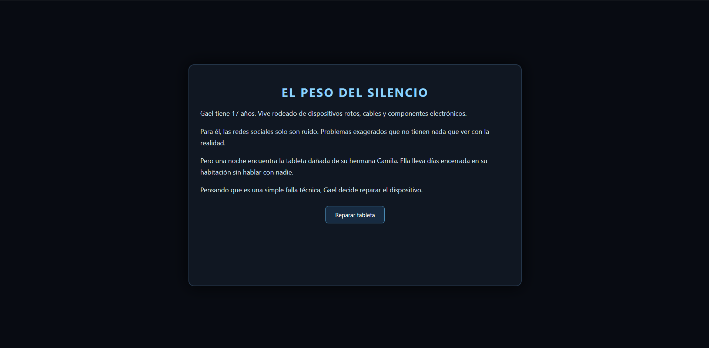
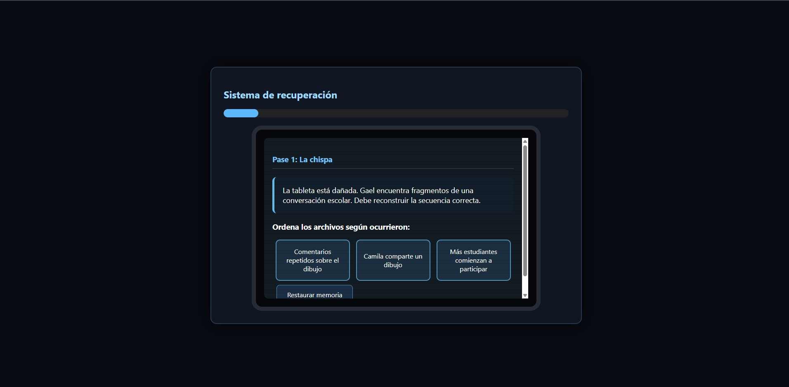
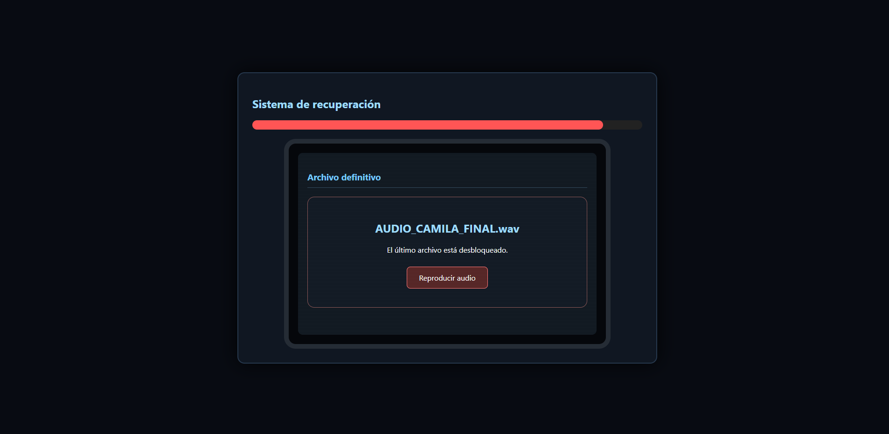
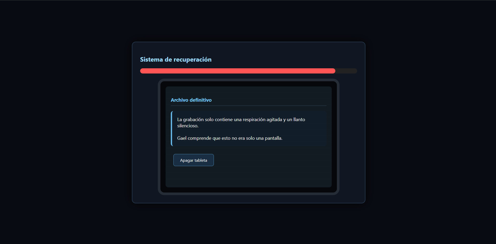

# El Peso del Silencio[cite: 13]

[HAGA CLIC AQUÍ PARA JUGAR EN LÍNEA](https://ArielAcarapi.github.io/game-development-portfolio/ElPesoDelSilencio/)

---

## Descripción del Juego

**El Peso del Silencio** es un videojuego interactivo de exploración narrativa y resolución de rompecabezas centrado en la concienciación sobre el acoso digital (ciberbullying) en adolescentes[cite: 12, 13].

El jugador toma el rol de Gael, un joven de 17 años apasionado por la reparación técnica[cite: 12, 13]. Al intentar reparar la tableta dañada de su hermana menor Camila, Gael se adentra en la memoria corrupta del sistema[cite: 12, 13]. A través del reordenamiento de archivos, filtrado de datos e investigación de mensajes no enviados, el jugador descubre de forma progresiva la campaña de acoso virtual que sufrió Camila[cite: 12, 13].

### Objetivo del Jugador
Reconstruir los registros del sistema dañados a lo largo de las distintas fases de recuperación para revelar el archivo final y comprender el impacto emocional del acoso digital[cite: 12, 13].

### Mecánica Principal
* **Reconstrucción de Secuencia Cronológica:** Ordenar piezas de conversaciones en el orden exacto en el que sucedieron[cite: 13].
* **Filtrado de Memoria Caché:** Seleccionar únicamente los archivos relevantes (capturas, audios) descartando el ruido publicitario[cite: 13].
* **Interpretación de Borradores:** Completar los borradores de mensajes no enviados para desbloquear el archivo definitivo[cite: 13].

---

## Ficha Técnica

| Parámetro | Detalle |
| :--- | :--- |
| **Nombre Definitivo** | El Peso del Silencio[cite: 13] |
| **Desarrollador** | Ariel Vidal Acarapi Limachi |
| **Género** | Narrativo / Puzzle / Aventura Interactiva[cite: 11, 12] |
| **Público Objetivo** | Adolescentes de 13 a 17 años[cite: 12] |
| **Plataforma** | Web (Ejecución directa en navegador)[cite: 11, 13] |
| **Lenguajes y Herramientas** | HTML5, CSS3, JavaScript Vanilla[cite: 11, 13] |
| **Estilo Visual** | Simulación de interfaz de sistema operativo de tableta corrupta con barra de carga emocional e indicadores visuales de distorsión[cite: 13] |

---

## Controles e Instrucciones

El juego se ejecuta completamente mediante puntero o pantalla táctil[cite: 11, 13]:

* **Mouse / Clic / Pantalla Táctil:** Seleccionar elementos en pantalla, ordenar fragmentos de texto, filtrar archivos y avanzar a través de los diálogos[cite: 13].

### Reglas de Juego
1. **Fase 1 (La chispa):** Seleccionar los tres fragmentos de la conversación inicial en el orden cronológico correcto (compartir dibujo, comentarios repetidos, participación masiva)[cite: 13].
2. **Fase 2 (La escalada):** Hacer clic sobre los archivos relevantes de la memoria (capturas de chat y audios) ignorando la publicidad[cite: 13].
3. **Fase 3 (El aislamiento):** Reconstruir la respuesta correcta del borrador no enviado por Camila[cite: 13].
4. **Archivo Final:** Reproducir la grabación de audio para completar el diagnóstico y dar fin a la reparación técnica[cite: 13].

---

## Storytelling y Estructura Narrativa

El juego aplica el principio **"Show don't tell"**, evitando mensajes moralizantes o explicativos para permitir que el jugador experimente la gravedad de la situación a través de los datos descubiertos[cite: 12].

### Arco de Personaje (Gael)
* **Inicio:** Gael es pragmático y observador, dedicado a reparar dispositivos[cite: 12, 13]. Considera que las redes sociales y sus problemas son "dramas adolescentes exagerados"[cite: 12, 13].
* **Situación de Cambio:** Su hermana Camila se aísla en su habitación sin hablar con nadie[cite: 12, 13]. Al reparar su tableta, Gael navega por conversaciones y archivos borrados, reconstruyendo el acoso que ella sufría[cite: 12, 13].
* **Final:** Comprende la magnitud del dolor invisible provocado por el acoso virtual[cite: 12]. Apaga la tableta y decide ir a la habitación de Camila a brindarle apoyo de forma presencial[cite: 12, 13].

### Tipo de Narrativa
* **Narrativa Lineal:** Se utiliza una secuencia cronológica estricta para que el jugador descubra paso a paso la escalada de la situación y sienta el peso emocional del desenlace[cite: 12].

---

## Capturas de Pantalla

| Pantalla de Inicio | Ordenamiento de Archivos |
| :---: | :---: |
|  |  |

| Filtrado de Memoria | Pantalla Final |
| :---: | :---: |
|  |  |

---

### Registro de Mejoras e Iteraciones

| Versión | Problema Detectado | Acción Realizada | Resultado |
| :---: | :--- | :--- | :--- |
| **V1** | Las pantallas eran demasiado estáticas y no transmitían la sensación de un dispositivo dañado. | Se agregaron animaciones de distorsión (*glitch*) y transiciones visuales en CSS[cite: 13]. | Ambiente de sistema operativo corrupto más inmersivo[cite: 13]. |
| **V2** | La progresión narrativa no mostraba el impacto emocional en el sistema. | Se implementó una barra dinámica que incrementa el peso emocional según las evidencias recuperadas[cite: 13]. | Feedback visual claro del avance de la historia[cite: 13]. |
| **V3** | Las opciones de interacción resultaban ambiguas en la fase final. | Se simplificó la interfaz del archivo de audio con botones de acción directa[cite: 13]. | Experiencia fluida y enfocada en el desenlace emocional[cite: 13]. |

---

### Mejoras para Versiones Futuras
* **Efectos de Sonido Realistas:** Incorporar pistas de audio para las pulsaciones de botones y efectos sintéticos de interferencia digital[cite: 13].
* **Mayor variedad de Puzzles:** Añadir desencriptación de imágenes fragmentadas en la Fase 2[cite: 13].
* **Líneas de Diálogo Adicionales:** Expandir los borradores de mensajes para profundizar en la perspectiva de los personajes secundarios[cite: 13].
