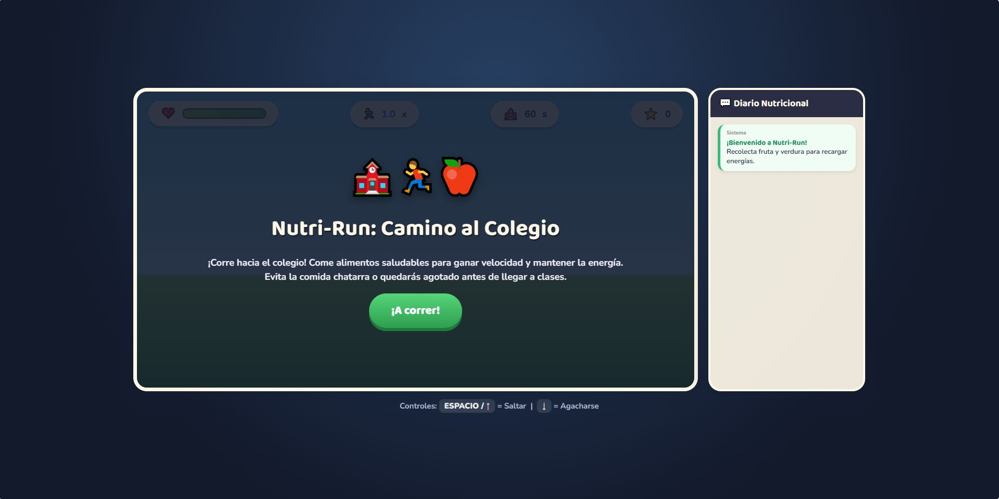
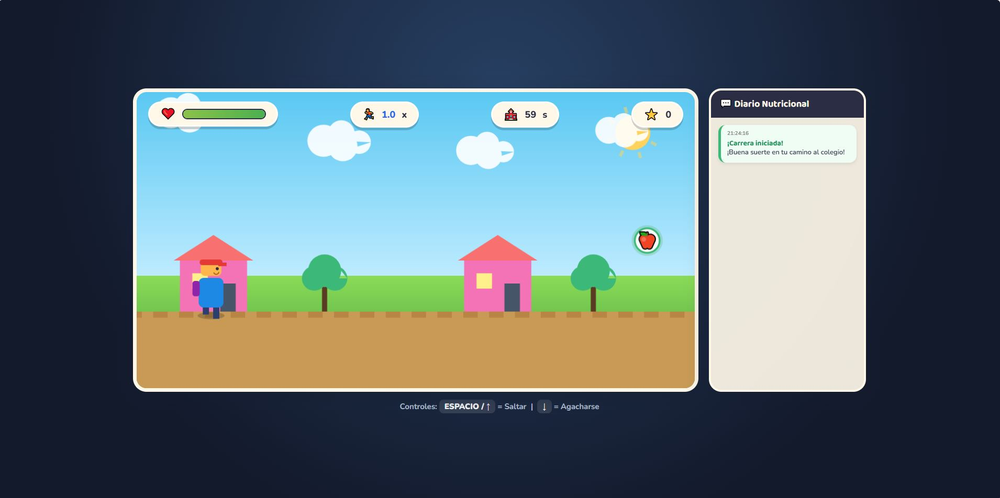
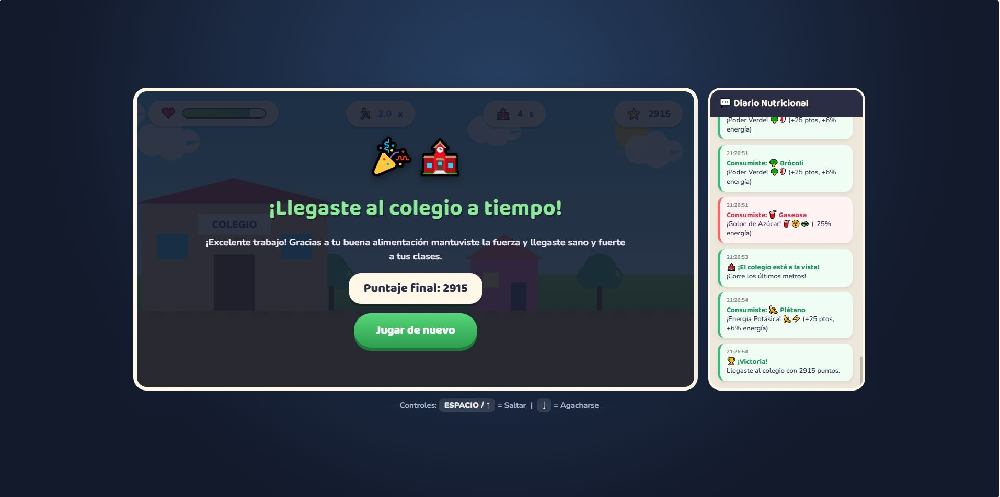
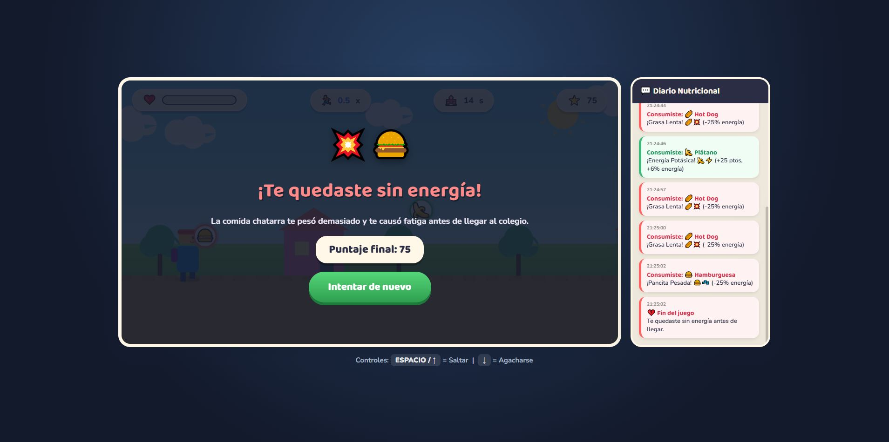

# Nutri-Run: Camino al Colegio

[](#)
[](#)
[](#)
[](#)

[Haga clic aquí para jugar en línea](https://ArielAcarapi.github.io/game-development-portfolio/Nutri-run/)

---

## Descripción del Juego

Nutri-Run: Camino al Colegio es un videojuego web educativo desarrollado para responder a la problemática planteada por la ONG VidaSana. Su propósito es enseñar a estudiantes en edad escolar la importancia de una alimentación saludable mediante una experiencia interactiva del género Arcade / Endless Runner 2D.

El jugador controla a un estudiante que corre hacia el colegio a lo largo de un trayecto de 60 segundos. Durante la carrera, aparecen continuamente diversos alimentos que deben ser evaluados en fracciones de segundo para decidir si recolectarlos o esquivarlos.

### Objetivo del Jugador
Llegar a la meta (el colegio) antes de que finalice el tiempo limite, manteniendo la barra de energía elevada a través del consumo de alimentos saludables y evitando perder vitalidad por el consumo de comida chatarra.

### Mecánica Principal
* Salto e Intercepción: Usar la Tecla Arriba o Barra Espaciadora para saltar y atrapar alimentos saludables situados en el aire o esquivar obstáculos terrestres.
* Agachado / Desplazamiento Bajo: Usar la Tecla Abajo para agacharse y evitar alimentos no saludables flotantes.
* Registro Nutricional en Tiempo Real: Un panel lateral tipo diario de navegación registra de forma inmediata el impacto nutricional positivo o negativo de cada elemento consumido.

---

## Ficha Técnica

| Parámetro | Detalle |
| :--- | :--- |
| Nombre Definitivo | Nutri-Run: Camino al Colegio |
| Desarrollador | Ariel Vidal Acarapi Limachi |
| Género | Arcade / Endless Runner 2D |
| Público Objetivo | Niños y adolescentes en edad escolar (8 a 16 años) |
| Plataforma | Web (Ejecución directa en navegador) |
| Lenguajes y Herramientas | HTML5 Canvas API, CSS3, JavaScript Vanilla |
| Estilo Visual | Gráficos vectoriales por código Canvas, efectos de partículas, interfaz adaptativa y registro de chat |

---

## Marco MDA (Mechanics, Dynamics, Aesthetics)

### 1. Mecánicas (Mechanics)
* Desplazamiento horizontal automático con aceleración progresiva.
* Salto mediante Tecla Arriba / Barra Espaciadora.
* Agachado mediante Tecla Abajo.
* Sistema de colisiones por hitboxes entre el jugador y los elementos alimenticios.
* Barra de energía que actúa como medidor de salud y condición de victoria/derrota.

### 2. Dinámicas (Dynamics)
El jugador evalúa visualmente en fracciones de segundo los alimentos que se aproximan en pantalla. Decide en tiempo real si saltar para atrapar comida saludable (manzanas, plátanos, brócoli, zanahorias) o esquivar para evitar la comida ultraprocesada (hamburguesas, hot dogs, gaseosas, donas).

### 3. Estética (Aesthetics)
Entusiasmo, dinamismo y reto. El entorno visual colorido y la retroalimentación inmediata (ranchas de combo, partículas y avisos nutricionales) mantienen la atención activa del estudiante y promueven la motivación.

---

## Controles e Instrucciones

### Controles de Teclado
* Barra Espaciadora / Flecha Arriba: Saltar.
* Flecha Abajo: Agacharse.

### Reglas del Juego
1. Tiempo de Carrera: El recorrido hacia el colegio dura 60 segundos.
2. Alimentos Saludables (+25 puntos, +6% energía): Manzana, Plátano, Brócoli, Zanahoria. Aumentan la velocidad de movimiento y otorgan multiplicador de racha (combo).
3. Comida Chatarra (-25% energía): Hamburguesa, Hot Dog, Gaseosa, Dona. Reducen drásticamente la energía y frenan el avance del estudiante.
4. Condición de Victoria: Llegar al colegio dentro del límite de tiempo manteniendo la barra de energía.
5. Condición de Derrota: Agotar completamente la barra de energía debido al consumo acumulado de comida chatarra antes de llegar a la meta.

---

## Capturas de Pantalla

| Pantalla de Inicio | Carrera y Captura de Alimentos |
| :---: | :---: |
|  |  |

| Llegada al Colegio (Victoria) | Agotamiento de Energía (Derrota) |
| :---: | :---: |
|  |  |

---

## Proceso de Desarrollo y Uso de Inteligencia Artificial

### Prompt Utilizado para la Generación
```text
Crea un videojuego web 2D en HTML5, CSS3 y JavaScript del género Arcade / Endless Runner titulado 'Nutri-Run: Camino al Colegio' enfocado en educar sobre alimentación saludable a escolares. El jugador controla a un estudiante que corre hacia el colegio durante un tiempo límite de 60 segundos. Debe esquivar comida chatarra (hamburguesas, hot dogs, gaseosas, donas) agachándose o saltando, y recolectar alimentos saludables (manzanas, plátanos, brócoli, zanahorias) para aumentar su barra de energía y velocidad. Incluye un panel lateral de Diario Nutricional que registre el impacto de cada alimento consumido en tiempo real, efectos visuales de partículas, multiplicador de racha (combo) y pantallas de victoria o derrota según el nivel de energía.
