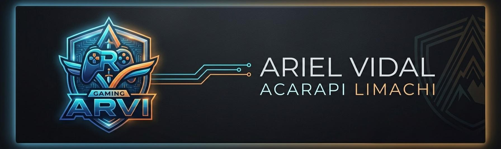

  

### ¡Hola! Soy **Ariel Vidal Acarapi Limachi**
**Estudiante de Game Development y apasionado del diseño de videojuegos**

---

## Sobre Mí

Bienvenido a mi portafolio digital de desarrollo de videojuegos. Soy **Ariel Vidal Acarapi Limachi**, estudiante de la asignatura de **Game Development**. Me apasiona el diseño de videojuegos, la lógica de programación y la creación de experiencias interactivas atractivas e intuitivas para el usuario.

* **Enfoque:** Lógica de programación, desarrollo web interactivo, diseño de interfaces visuales y prototipado rápido con IA.
* **Tecnologías:** HTML, JavaScript, CSS, HTML5 Canvas, Web Audio API, GitHub y Herramientas de IA Generativa.
* **Objetivo:** Comunicar y visibilizar los videojuegos y prototipos desarrollados durante la materia, demostrando la aplicación de mecánicas, diseño de juegos y tecnología educativa.

---

## Galería de Videojuegos

Explora los prototipos y videojuegos desarrollados a lo largo del curso. Haz clic en los enlaces para jugar en línea o revisar el código y documentación de cada proyecto.

| # | Juego | Género | Motor / Tech | Descripción | Enlaces |
| :-: | :--- | :--- | :--- | :--- | :--- |
| **01** | **Zombie Loop: Mazmorra Matemática** | Arcade / Puzzle / RPG | HTML5 Canvas / JS | Dungeon crawler retro donde enfrentas monstruos resolviendo operaciones aritméticas. | [Proyecto](./ZombieLoop)   [Jugar en línea](https://ArielAcarapi.github.io/game-development-portfolio/ZombieLoop/) |
| **02** | **EcoSort: Desafío de Reciclaje** | Arcade / Educativo | HTML5 / CSS3 / JS | Videojuego educativo sobre la clasificación correcta de residuos en sus respectivos contenedores. | [Proyecto](./EcoSort)   [Jugar en línea](https://ArielAcarapi.github.io/game-development-portfolio/EcoSort/) |
| **03** | **Defensa del Bolsillo Central** | Tower Defense / Estrategia | HTML5 Canvas / Web Audio API | Juego de estrategia isométrica centrado en la gestión presupuestaria y mantenimiento defensivo. | [Proyecto](./DefensaBC)   [Jugar en línea](https://ArielAcarapi.github.io/game-development-portfolio/DefensaBC/) |
| **04** | **Agualto: Desafío Hídrico** | Arcade / Educativo | HTML5 Canvas / JS | Experiencia interactiva sobre la recolección y conservación responsable de los recursos hídricos. | [Proyecto](./Agualto)   [Jugar en línea](https://ArielAcarapi.github.io/game-development-portfolio/Agualto/) |
| **05** | **Nutri-Run** | Endless Runner / Salud | HTML5 / CSS3 / JS | Runner educativo enfocado en la recolección de alimentos saludables y promoción de buenos hábitos. | [Proyecto](./Nutri-run)   [Jugar en línea](https://ArielAcarapi.github.io/game-development-portfolio/Nutri-run/) |
| **06** | **El Peso del Silencio** | Aventura / Narrativo / Puzzle | HTML5 Canvas / JS | Experiencia interactiva centrada en la toma de decisiones, narrativa inmersiva y resolución de acertijos. | [Proyecto](./ElPesoDelSilencio)   [Jugar en línea](https://ArielAcarapi.github.io/game-development-portfolio/ElPesoDelSilencio/) |
