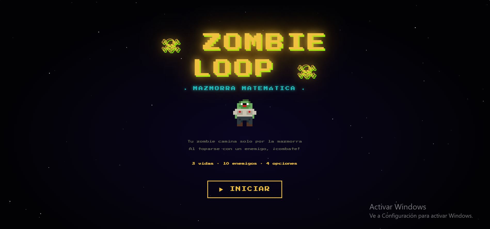
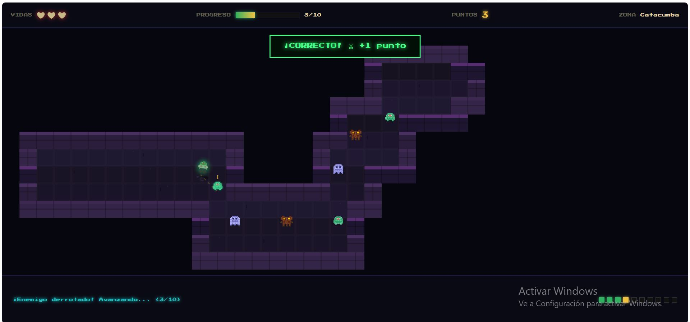
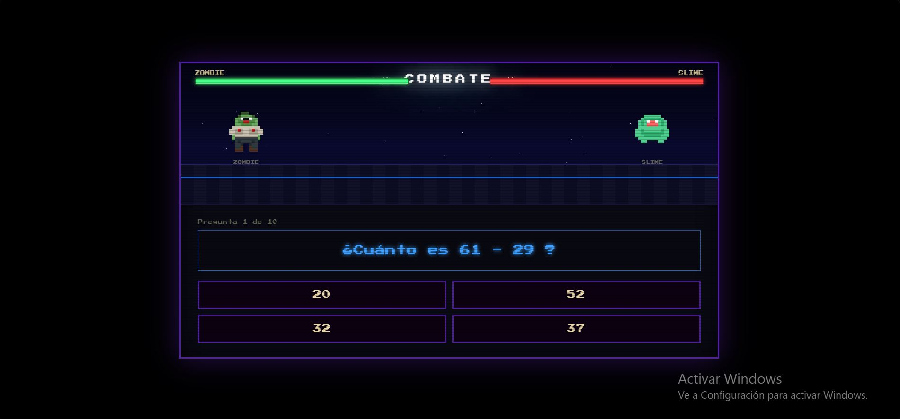
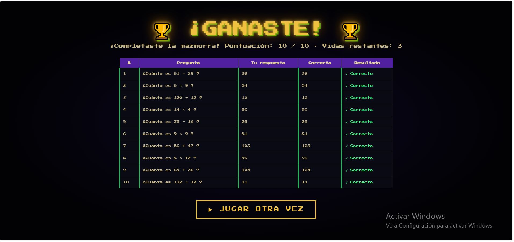

# Zombie Loop: Mazmorra Matemática

  

[HAGA CLIC AQUÍ PARA JUGAR EN LÍNEA](https://ArielAcarapi.github.io/game-development-portfolio/ZombieLoop/)

---

## Descripción del Juego

**Zombie Loop: Mazmorra Matemática** es un videojuego educativo con estética retro *Pixel Art* de 8 bits. Está diseñado para estudiantes de nivel secundario (1ro de secundaria) con el objetivo de ejercitar operaciones aritméticas básicas de forma entretenida e interactiva.

El jugador toma el control de un zombie que recorre automáticamente una mazmorra llena de trampas y monstruos (slimes, espectros y bestias). Para avanzar y sobrevivir a cada encuentro en las catacumbas, el jugador debe resolver correctamente preguntas matemáticas de opción múltiple antes de quedarse sin vidas.

### Objetivo del Jugador
Superar los 10 combates en la mazmorra respondiendo correctamente a las operaciones aritméticas para llegar al final con la mayor cantidad de vidas posibles y obtener una puntuación perfecta (**10/10**).

### Mecánica Principal
* **Exploración:** Desplazamiento automático sobre un mapa 2D en cuadrícula (*Top-down*) con animaciones fluidas y efectos visuales retro.
* **Sistema de Combate Turn-Based (Quiz RPG):** Al colisionar con un enemigo, se activa una arena de combate por turnos donde atacar o recibir daño depende de seleccionar la respuesta correcta entre 4 alternativas.

---

## Ficha Técnica

| Parámetro | Detalle |
| :--- | :--- |
| **Nombre Definitivo** | Zombie Loop: Mazmorra Matemática |
| **Desarrollador** | Ariel Vidal Acarapi Limachi |
| **Género** | Arcade / Puzzle / Dungeon Crawler / RPG |
| **Público Objetivo** | Estudiantes de 1ro de secundaria (11-13 años) |
| **Plataforma** | Web (Ejecución directa en navegador) |
| **Lenguajes y Herramientas** | HTML5, CSS3, JavaScript Vanilla (Sin librerías externas), HTML5 Canvas |
| **Estilo Visual** | Pixel Art renderizado por matrices CSS/Canvas con tipografía *Press Start 2P* |

---

## Controles e Instrucciones

El juego está diseñado para jugarse cómodamente desde cualquier dispositivo (PC, Tablet o Móvil) utilizando interfaz táctil o puntero de ratón:

* **Mouse / Clic / Pantalla Táctil:** Seleccionar las opciones de respuesta durante los combates y navegar entre los menús de la interfaz.

### Reglas de Juego
1. **Vidas Iniciales:** Comienzas la aventura con **3 vidas** (representadas por corazones).
2. **Progreso y Enemigos:** La mazmorra contiene **10 enemigos** generados a lo largo del camino.
3. **Preguntas Aritméticas:** Cada combate presenta una operación aleatoria de suma (`+`), resta (`-`), multiplicación (`×`) o división (`÷`).
4. **Retroalimentación (Feedback):**
   * **Respuesta Correcta:** Realizas un ataque, eliminas al enemigo, sumas **+1 punto** y el personaje continúa su camino hacia la siguiente zona.
   * **Respuesta Incorrecta:** El enemigo te ataca, pierdes **1 vida** y se muestra la respuesta correcta para aprender del error.
5. **Condición de Victoria:** Derrotar a los 10 enemigos manteniendo al menos 1 vida.
6. **Condición de Derrota:** Perder las 3 vidas durante la exploración (Game Over). Al finalizar se muestra una tabla de revisión con todas tus respuestas.

---

## Capturas de Pantalla

| Pantalla Principal | Exploración de la Mazmorra |
| :---: | :---: |
|  |  |

| Arena de Combate | Pantalla de Resultados |
| :---: | :---: |
|  |  |
